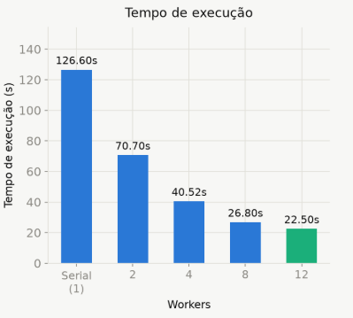
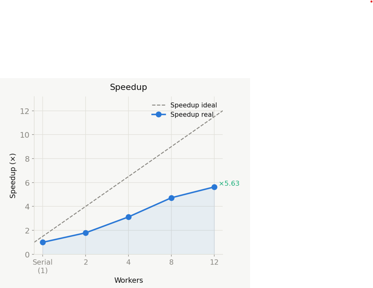
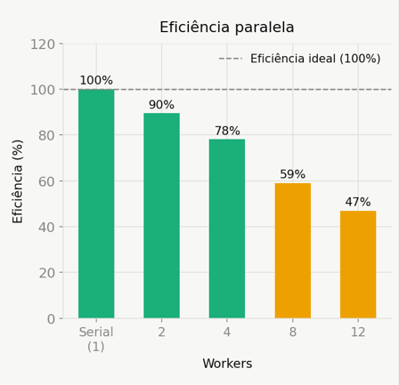

# trabalho-prog-concorrente
Trabalho de duplas para a matéria de programação concorrente distribuída.  
 
# Sistema Paralelo de Processamento de Avaliações de Filmes com MovieLens 10.5 M
 
## Disciplina
 
Programação Concorrente e Distribuída
 
## Professor
 
Rafael Marconi
 
## Integrantes
 
- Filipe Ferreira
- Max Muller
---
 
# Descrição
 
Este projeto utiliza o dataset MovieLens 10.5 M para processar milhões de avaliações de filmes em paralelo, gerando rankings automáticos por categoria.
 
O foco principal do sistema é demonstrar conceitos de:
 
- concorrência
- paralelismo
- processamento distribuído
- análise de desempenho
- escalabilidade
- processamento de grandes volumes de dados
O sistema processa mais de 10.5 milhões de avaliações utilizando múltiplos workers, reduzindo significativamente o tempo de execução em comparação com o processamento serial.
 
---
 
# Objetivos
 
- Processar mais de 10.5 milhões de avaliações de filmes
- Calcular médias de avaliações
- Identificar filmes mais populares
- Executar processamento paralelo utilizando múltiplos workers
- Comparar execução serial vs paralela
- Medir ganho de performance e escalabilidade
---
 
# Dataset
 
Foi utilizado o dataset MovieLens 10.5 M, disponibilizado pelo GroupLens Research.
 
O dataset contém:
 
- 10.5 milhões de avaliações
- aproximadamente 10 mil filmes
- milhares de usuários
- informações de gêneros e timestamps
Fonte oficial:
 
https://grouplens.org/datasets/movielens/tag-genome-2021/
 
---
 
# Funcionalidades
 
## Rankings
 
- Top 10 filmes de todos listados
- Filmes mais avaliados
- Filmes com melhor média
## Processamento Paralelo
 
O sistema divide o processamento em múltiplos workers para acelerar os cálculos.
 
Cada worker processa:
 
- agrupamento de avaliações
- cálculo de médias
- ordenação
- geração de rankings
---
 
# Arquitetura
 
```txt
Cliente/API
     ↓
Banco de Dados
     ↓
Fila de Processamento
     ↓
+-----------+-----------+
| Worker 1  | Worker 2  |
| Worker 3  | Worker 4  |
+-----------+-----------+
```
 
---
 
# Tecnologias Utilizadas
 
- Python
- FastAPI
- multiprocessing
- concurrent.futures
---
 
# Estrutura do Projeto
 
```txt
project/
│
├── api/
├── workers/
├── database/
├── datasets/
├── processing/
├── benchmarks/
├── docker-compose.yml
└── README.md
```
 
---
 
# Algoritmo Utilizado
 
# Processamento Paralelo
 
O sistema utiliza múltiplos processos para distribuir a carga de trabalho.
 
Estratégia utilizada:
 
- processamento em paralelo
- agregação final dos resultados
Tecnologias utilizadas:
 
```python
multiprocessing
ProcessPoolExecutor
```
 
---
 
# Benchmark
 
Comparação entre execução serial e paralela com dados reais (28.490.116 linhas processadas):
 
| Threads/Processos | Tempo (s) | Speedup | Eficiência |
|---|---|---|---|
| 1 (Serial) | 126.60s | 1.00x | 100.0% |
| 2 | 70.70s | 1.79x | 89.7% |
| 4 | 40.52s | 3.12x | 78.1% |
| 8 | 26.80s | 4.72x | 59.1% |
| **12** | **22.50s** | **5.63x** | **46.9%** ✓ |
 
O processamento paralelo reduz significativamente o tempo total de execução, com ganho máximo de **5.63x** utilizando 12 workers.
 
## Gráfico de Tempo de Execução
 

 
## Gráfico de Speedup
 

 
## Gráfico de Eficiência
 

 
---
 
# Escalabilidade
 
O sistema foi projetado para suportar grandes volumes de dados através de:
 
- processamento paralelo
- divisão de tarefas
- múltiplos workers
- execução distribuída
- otimização de consultas
---
 
# Exemplo de Resultado
 
| Ranking | Filme | Nota Média |
|---|---|---|
| 1 | Planet Earth II (2016) | 4.48 |
| 2 | Planet Earth (2006) | 4.46 |
| 3 | Shawshank Redemption, The (1994) | 4.42 |
| 4 | Band of Brothers (2001) | 4.39 |
| 5 | Cosmos | 4.39 |
 
---
 
# Como Executar
 
## Clonar o projeto
 
```bash
git clone https://github.com/seu-usuario/seu-repositorio.git
```
 
## Instalar dependências
 
```bash
pip install -r requirements.txt
```
 
## Executar o sistema
 
```bash
python main.py
```
 
## Gerar os gráficos de benchmark
 
```bash
pip install matplotlib numpy
python benchmark_charts.py
```
 
---
 
# Conceitos Aplicados
 
## Concorrência
 
- múltiplos processos
- sincronização
- divisão de tarefas
## Processamento Distribuído
 
- workers independentes
- paralelização de cálculos
- distribuição de carga
## Banco de Dados
 
- consultas SQL
- agregações
- armazenamento de grandes volumes
## Performance
 
- benchmark
- throughput
- speedup
- escalabilidade
---
 
# Resultados Obtidos
 
## Dados Processados
 
| Métrica | Valor |
|---|---|
| Total de filmes catalogados | 84.661 |
| Total de linhas carregadas da base | 28.490.116 |
| Workers utilizados | 2, 4, 8 e 12 |
| Lotes de processamento | 23 |
 
## Análise de Desempenho
 
| Threads/Processos | Tempo (s) | Speedup | Eficiência |
|---|---|---|---|
| 1 (Serial) | 126.60s | 1.00x | 100.0% |
| 2 | 70.70s | 1.79x | 89.7% |
| 4 | 40.52s | 3.12x | 78.1% |
| 8 | 26.80s | 4.72x | 59.1% |
| **12** | **22.50s** | **5.63x** | **46.9%** ✓ |
 
O processamento paralelo com 12 workers atingiu o melhor resultado: **5.63x mais rápido** que o modo serial, com tempo de **22.50s**. A queda progressiva de eficiência (100% → 46.9%) é esperada e se deve ao overhead de gerenciamento de processos e à saturação dos núcleos físicos disponíveis.
 
---
 
## TOP 10 Filmes Mais Avaliados (Geral)
 
| Ranking | Filme | Avaliações |
|---|---|---|
| 1 | Shawshank Redemption, The (1994) | 197.934 |
| 2 | Forrest Gump (1994) | 195.544 |
| 3 | Pulp Fiction (1994) | 186.312 |
| 4 | Silence of the Lambs, The (1991) | 177.146 |
| 5 | Matrix, The (1999) | 170.862 |
| 6 | Star Wars: Episode IV - A New Hope (1977) | 164.900 |
| 7 | Jurassic Park (1993) | 153.584 |
| 8 | Schindler's List (1993) | 144.286 |
| 9 | Braveheart (1995) | 138.380 |
| 10 | Toy Story (1995) | 137.768 |
 
---
 
## TOP 10 Filmes com Melhor Média (Geral)
 
| Ranking | Filme | Nota Média | Avaliações |
|---|---|---|---|
| 1 | Planet Earth II (2016) | 4.48 | 2.208 |
| 2 | Planet Earth (2006) | 4.46 | 3.362 |
| 3 | Shawshank Redemption, The (1994) | 4.42 | 197.934 |
| 4 | Band of Brothers (2001) | 4.39 | 2.634 |
| 5 | Cosmos | 4.39 | 526 |
| 6 | Twin Peaks (1989) | 4.35 | 606 |
| 7 | Cosmos: A Spacetime Odyssey | 4.36 | 360 |
| 8 | Schindler's List (1993) | 4.35 | 144.286 |
| 9 | Rear Window (1954) | 4.34 | 16.318 |
| 10 | Casablanca (1942) | 4.34 | 20.160 |
 
> Nota: alguns filmes aparecem como "ID Desconhecido" pois seus metadados não constam no arquivo `metadata_updated.json` do dataset utilizado.
 
---
 
# Considerações Finais
 
O projeto demonstra na prática a utilização de técnicas de programação concorrente e distribuída aplicadas ao processamento de grandes volumes de dados.
 
A utilização de múltiplos workers permitiu reduzir significativamente o tempo de execução, evidenciando os benefícios do paralelismo em aplicações de análise de dados em larga escala. O experimento também revela o fenômeno de saturação de workers: a eficiência cai progressivamente de 100% com 1 processo até 46.9% com 12 workers, demonstrando que o overhead de comunicação e o limite de núcleos físicos disponíveis na máquina reduzem o aproveitamento relativo de cada processo adicionado.
